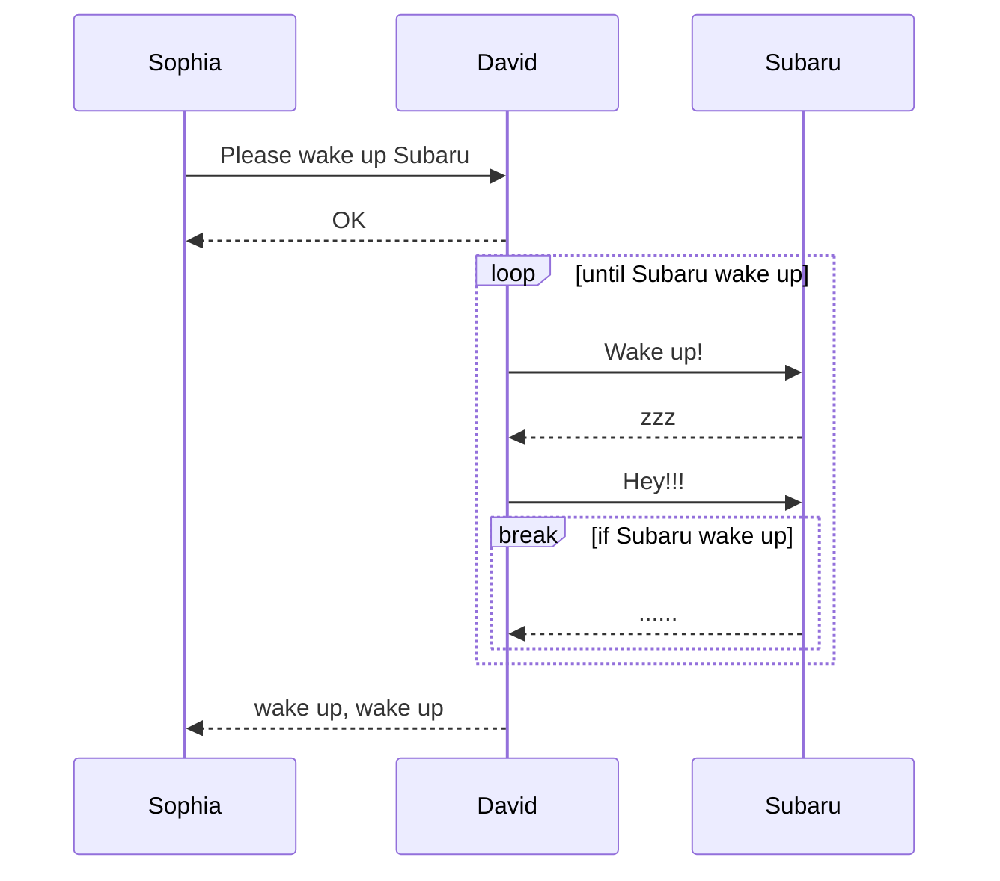

[](https://pkg.go.dev/github.com/go-spectest/mermaid)
[](https://github.com/go-spectest/mermaid/actions/workflows/linux_test.yml)
[](https://github.com/go-spectest/mermaid/actions/workflows/mac_test.yml)
[](https://github.com/go-spectest/mermaid/actions/workflows/windows_test.yml)
[](https://github.com/go-spectest/mermaid/actions/workflows/reviewdog.yml)
[](https://github.com/go-spectest/mermaid/actions/workflows/gosec.yml)

# What is mermaid package
The Package mermaid is a simple mermaid builder in golang. This library assembles mermaid using method chaining, not uses a template engine like [html/template](https://pkg.go.dev/html/template). Currently, this library supports only sequence diagram. 
  
This library was initially developed to display test results in [go-spectest/spectest](https://github.com/go-spectest/spectest). Therefore, it implements the features required by spectest, but there are no plans to add additional functionalities unless requested by someone. This library is intended to be used in conjunction with [go-spectest/markdown](https://github.com/go-spectest/markdown).
  
Additionally, complex code that increases the complexity of the library, such as generating nested lists, will not be added. I want to keep this library as simple as possible.
  
## Supported OS and Go version
- OS: Linux, macOS, Windows
- Go: 1.18 or later
  
## Supported mermaid syntax (sequence diagram)
- [x] participant
- [ ] participant alias (not supported)
- [x] actor
- [ ] actor alias (not supported)
- [x] activate / deactivate
- [x] note over / left of / right of
- [ ] link
- [x] sync / async request
- [x] sync / async response
- [x] loop
- [x] alt / else / opt
- [x] parallel
- [x] break
- [x] critical
- [x] group

## Example
### Basic usage
Generate mermaid in markdown. You can generate mermaid using go generate. Please define code to generate Mermaid first. Then, run "go generate ./..." to generate it.

```go
package main

import (
	"os"

	"github.com/go-spectest/markdown"
	"github.com/go-spectest/mermaid/sequence"
)

//go:generate go run main.go

func main() {
	diagram := sequence.NewDiagram(os.Stdout).
		Participant("Sophia").
		Participant("David").
		Participant("Subaru").
		LF().
		SyncRequest("Sophia", "David", "Please wake up Subaru").
		SyncResponse("David", "Sophia", "OK").
		LF().
		LoopStart("until Subaru wake up").
		SyncRequest("David", "Subaru", "Wake up!").
		SyncResponse("Subaru", "David", "zzz").
		SyncRequest("David", "Subaru", "Hey!!!").
		BreakStart("if Subaru wake up").
		SyncResponse("Subaru", "David", "......").
		BreakEnd().
		LoopEnd().
		LF().
		SyncResponse("David", "Sophia", "wake up, wake up").
		String()

	markdown.NewMarkdown(os.Stdout).
		H2("Sequence Diagram").
		CodeBlocks(markdown.SyntaxHighlightMermaid, diagram).
		Build()
}
```

Plain text output: [markdown is here](./doc/generated.md)
````
## Sequence Diagram

````

Mermaid output:


## Contribution
First off, thanks for taking the time to contribute! Contributions are not only related to development. For example, GitHub Star motivates me to develop! Please feel free to contribute to this project.

## LICENSE
[MIT License](./LICENSE)